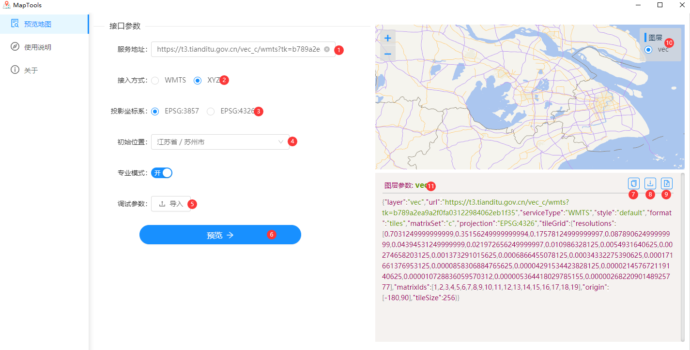
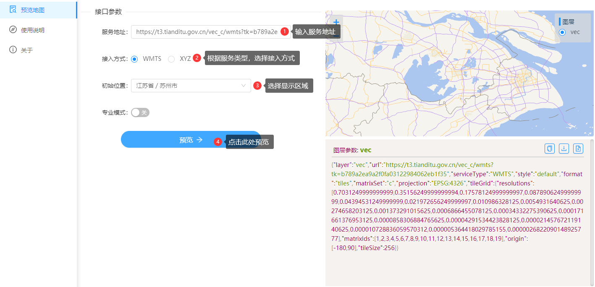
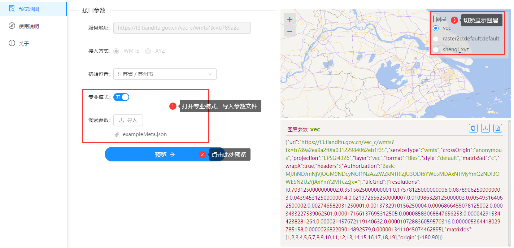

# Map Tools

## 目录

- [Map Tools](#map-tools)
  - [目录](#目录)
  - [1. 运行环境](#1-运行环境)
    - [1.1 启动程序](#11-启动程序)
  - [2. 功能介绍](#2-功能介绍)
    - [2.1 适用范围](#21-适用范围)
    - [2.2 界面预览](#22-界面预览)
    - [2.3 模块介绍](#23-模块介绍)
  - [3. 使用方式](#3-使用方式)
    - [3.1 一键预览模式](#31-一键预览模式)
      - [3.1.1 使用步骤](#311-使用步骤)
        - [3.1.1.1 WMTS 服务](#3111-wmts-服务)
        - [3.1.1.2 REST 服务（XYZ）](#3112-rest-服务xyz)
    - [3.2 专业模式](#32-专业模式)
      - [3.2.1 使用步骤](#321-使用步骤)
      - [3.2.2 参数文件说明](#322-参数文件说明)

## 1. 运行环境

- Window 系统 (x86-64)

### 1.1 启动程序

1. 解压程序包;
2. 运行根目录下 MapTools.exe 文件.

## 2. 功能介绍

此工具主要用于多种栅格地图服务的实时预览，启动后默认为`一键预览`模式，也可通过`专业模式`手动导入参数后预览。

### 2.1 适用范围

- 支持 OGC 标准下 WMTS，REST(XYZ)格式的栅格地图预览。
- 支持仅配置地图 URL 的直接预览方式。
- 支持手动配置地图切片参数。
- 专业模式下，支持一次预览多个地图
- 支持保存地图切片参数为 JSON
- 支持下载地图服务原始 XML 描述文件。

### 2.2 界面预览



### 2.3 模块介绍

1. 栅格地图瓦片的资源地址
2. 地图服务接口接入方式。
3. 选择 XYZ 接入方式时，需选择的投影坐标系。
4. 地图预览的初始中心点位置。
5. 开启`专业模式`时，导入地图参数的入口。
6. 预览按钮。
7. 一键复制当前所预览图层的切片参数。
8. 保存当前图层的切片参数为 JSON 文件。（默认保存在根目录 `"/resources"`中）
9. 保存地图服务的原始 XML 描述文件。（仅可保存 WMTS 服务类型）
10. 同时预览多个图层时，切换功能模块。
11. 标识当前显示的地图图层名称。

## 3. 使用方式

### 3.1 一键预览模式

> 注：使用此模式，地图服务接口需符合[OGC 标准](https://docs.opengeospatial.org/is/13-082r2/13-082r2.html)。



#### 3.1.1 使用步骤

##### 3.1.1.1 WMTS 服务

1. 填写地图`服务地址`;
2. 点击`预览`按钮;
3. 选择`初始位置`;
4. 显示地图。

示例参数

```json
"url":"https://t3.tianditu.gov.cn/vec_c/wmts?tk=b789a2ea9a2f0fa03122984062eb1f35"
```

##### 3.1.1.2 REST 服务（XYZ）

1. 填写地图`服务地址`;
2. 需选择符合地图服务的`投影规则;
3. 选择`初始位置`;
4. 点击`预览`按钮;
5. 即可显示地图。

示例参数

```json
"url": "https://t3.tianditu.gov.cn/vec_w/wmts?tk=b789a2ea9a2f0fa03122984062eb1f35&service=WMTS&version=1.0.0&request=GetTile&layer=vec&format=tiles&style=default&tileMatrixSet=w&tileMatrix={z}&tileRow={y}&tileCol={x}",

"投影规则":"EPSG:3857"

```

### 3.2 专业模式

专业模式下可手动配置地图参数，支持一次预览不同地图服务的不同图层,可在地图预览区域的图层模块，自由切换。



#### 3.2.1 使用步骤

1. 打开`专业模式`按钮;
2. 导入`参数文件`;(仅支持导入`JSON`格式文件)
3. 选择`初始位置`;
4. 点击`预览`按钮。

#### 3.2.2 参数文件说明

- `"layerSource"`: 必传字段，数组内为各图层参数。
- `"serviceType"`: 必传字段，标识此地图服务采用的接入规则。

示例参数：

```json
// exampleMeta.json
[
    {
      "url": "https://t3.tianditu.gov.cn/vec_c/wmts?tk=b789a2ea9a2f0fa03122984062eb1f35",
      "serviceType": "wmts",
      "crossOrigin": "anonymous",
      "projection": "EPSG:4326",
      "layer": "vec",
      "format": "tiles",
      "style": "default",
      "matrixSet": "c",
      "wrapX": true,
      "tileGrid": {
        "resolutions": [
          0.7031250000000002,
          0.3515625000000001,
          0.17578125000000006,
          0.08789062500000003,
          0.043945312500000014,
          0.021972656250000007,
          0.010986328125000003,
          0.005493164062500002,
          0.002746582031250001,
          0.0013732910156250004,
          0.0006866455078125002,
          0.0003433227539062501,
          0.00017166137695312505,
          0.00008583068847656253,
          0.000042915344238281264,
          0.000021457672119140632,
          0.000010728836059570316,
          0.000005364418029785158,
          0.000002682209014892579,
          0.0000013411045074462895
        ],
        "matrixIds": [
          1,
          2,
          3,
          4,
          5,
          6,
          7,
          8,
          9,
          10,
          11,
          12,
          13,
          14,
          15,
          16,
          17,
          18,
          19
        ],
        "origin": [-180, 90]
      }
    },
    {
      "layer": "tianditu_xyz",
      "url": "https://t3.tianditu.gov.cn/vec_w/wmts?tk=b789a2ea9a2f0fa03122984062eb1f35&service=WMTS&version=1.0.0&request=GetTile&layer=vec&format=tiles&style=default&tileMatrixSet=w&tileMatrix={z}&tileRow={y}&tileCol={x}",
      "serviceType": "xyz",
      "projection": "EPSG:3857"
    },
  ]
```
